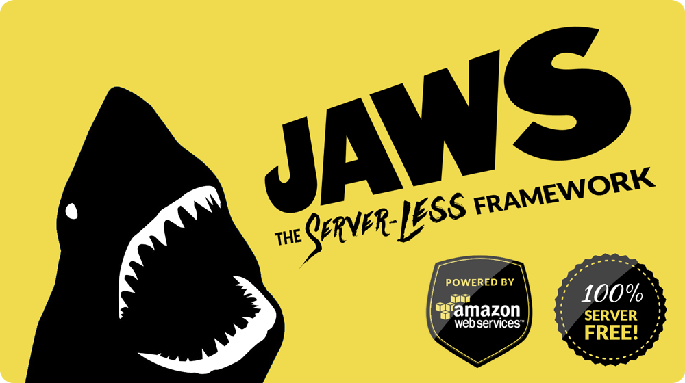

JAWS: The Server-less Framework V1 (BETA)
=================================

[](https://gitter.im/jaws-stack/JAWS?utm_source=badge&utm_medium=badge&utm_campaign=pr-badge)

Status 9/15: The **JAWS V1 BETA** is available HOWEVER we will be making breaking changes on 9/15 and 9/16.
We’ve decided to specify each project’s lambda functions within the CloudFormation templates generated for each stage
and region.  The lambda functions will now be uploaded to S3 and deployed via Cloudformation.  Also, we will be
creating an S3 bucket for each stage and region which will store ENV vars and lambda functions.  The goal is to
increase CloudFormation support and have ALL project resources, completely replicated across stage and region.
If you want to help, please view the **[JAWS V1 Google Document](https://docs.google.com/document/d/1SeTgtsQc620vcwgGMZ4F2yuWVf-A3JmpTn1VT8pKYsA/edit#)**.
But you might want to hold of Pull Requests until after 9/16.

**[Don't forget to join the JAWS Email List for updates!](http://eepurl.com/bvz5Nj)**

## Goals:

 - **No Servers:** The JAWS back-end is comprised entirely of AWS Lambda Functions.  You can develop/update/configure each separately without affecting any other part of your application.  Your app never goes down.  There is no app.  Only individual lambda functions can go down.
 - **Scale Infinitely:**  A back-end comprised of Lambda functions comes with a ton of concurrency.
 - **Be Cheap As Possible:**  Lambda functions run only when they are called, and you pay only when they are run.
 - **All Lambda Runtimes** While first release is `nodejs` only, we plan on adding support for all languages. This means each lambda in your JAWS project can be coded in the lang that best suites the problem.
 - **API Gateway Auto-Deploy** Creates your API endpoints for you on API Gateway.
 - **Multi-stage & Multi-Region:** Define stages for your project, and multiple regions with a stage. Driven by [CloudFormation](https://aws.amazon.com/cloudformation/).

## Architecture

Graphics coming soon...

## Quick Start

The guide below gets you started quickly.  Later, check out the [best practices](https://github.com/jaws-framework/JAWS/wiki/Best-practices) guide in our  [wiki](https://github.com/jaws-framework/JAWS/wiki) for tips on security and more.

*  **[Setup an AWS account and create an administrative user](https://github.com/jaws-framework/JAWS/wiki/v1:-AWS-Account-setup)**

*  ```$ npm install jaws-framework -g```

*  ```$ jaws new project```
  
 **Note:** we recommend camelCase for project names. [Why?](https://github.com/jaws-framework/JAWS/wiki/Best-practices#project-names)

*  ```$ cd <new-project-name>```

*  ```$ jaws new action users create -b```

* ```$ jaws dash```

This will create a new jaws project, create a lambda function and endpoint, which you can immediately deploy via
`jaws dash`.  After deployment is complete, you will be given a url.  In the above example, you can access your
deployed lambda at `your_url/users/create`.

## Where do I go from here?

We're currently working on our [docs](./docs/), [wiki](https://github.com/jaws-framework/JAWS/wiki), [best practices](https://github.com/jaws-framework/JAWS/wiki/Best-practices) and [FAQ](https://github.com/jaws-framework/JAWS/wiki/FAQ) pages.

Once you become familiar with JAWS, you can read the JAWS [plug-in module guide](./docs/plugin-module-guide.md) to start contributing JAWS modules to the community.

## How can I help?

Please check out the **[JAWS V1 Google Document](https://docs.google.com/document/d/1SeTgtsQc620vcwgGMZ4F2yuWVf-A3JmpTn1VT8pKYsA/edit#)** and our [CONTRIBUTING.md](./CONTRIBUTING.md) for coding and PR guidelines.
